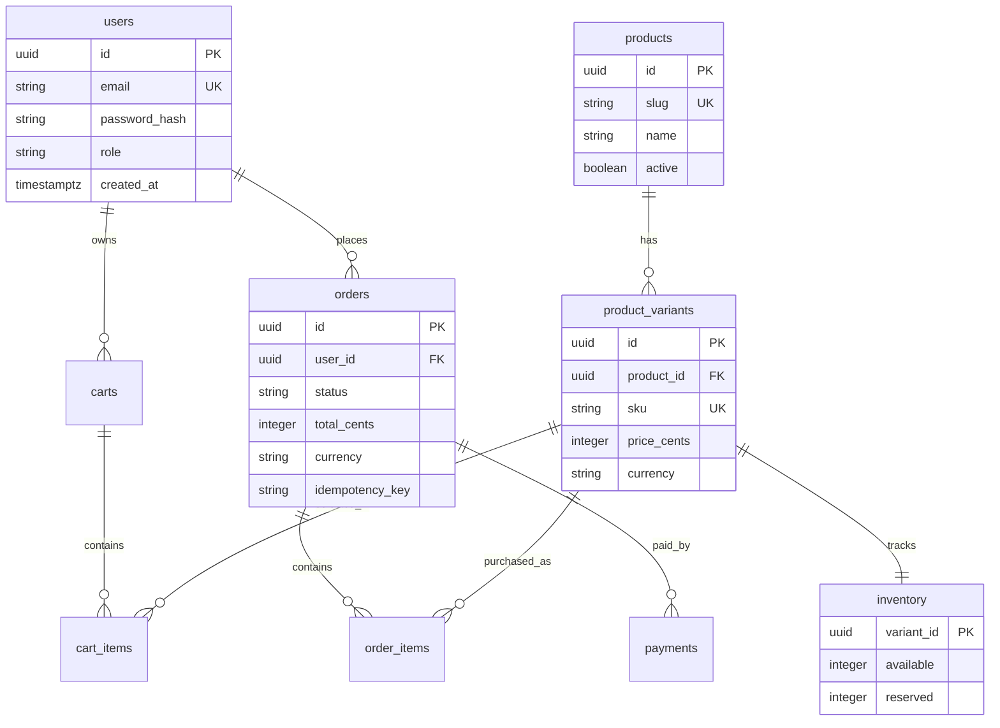

# Database Design

## 1. Problem

The database must preserve money, inventory, user identity, and order history accurately. E-commerce data is highly relational, and mistakes can cause financial loss or customer trust issues.

## 2. Design

### Important Constraints

- Unique emails and SKUs.
- Monetary values stored as integer cents.
- Foreign keys for order items and variants.
- Check constraints for non-negative inventory.
- Unique `(user_id, idempotency_key)` for checkout safety.

### Indexes

- `users(email)` for login.
- `products(slug)` for product detail pages.
- `product_variants(sku)` for inventory operations.
- `orders(user_id, created_at DESC)` for account order history.
- `orders(status, created_at)` for admin operations.

## 3. Alternatives

- Store cart in Redis for speed, but persist to PostgreSQL for cross-device recovery.
- Store product attributes in JSONB for flexibility, but use normalized columns for common filters.
- Use event sourcing for orders, but standard relational tables are easier for most teams.

## 4. Interview Questions

1. Why store money as integer cents?
2. Which indexes are needed for order history?
3. How do you model product variants?
4. How do you avoid negative inventory?
5. When would you denormalize product data?

## 5. Tradeoffs

- Normalization protects consistency but can require joins.
- JSONB improves catalog flexibility but weakens schema guarantees.
- Strong constraints reduce bugs but require careful migrations.
