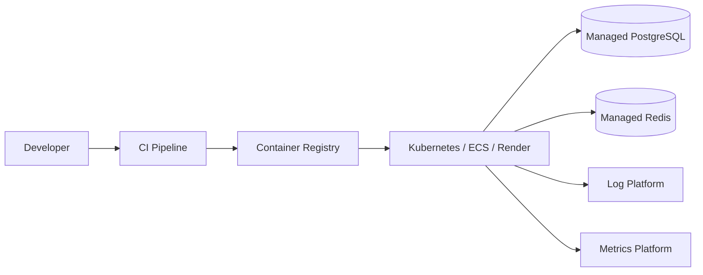

# Deployment Guide

## 1. Problem

Production deployment must make the backend repeatable, observable, secure, and reversible. A working local server is not enough; production requires migrations, secrets, health checks, scaling, and rollback strategy.

## 2. Design

### Deployment Topology

### Pipeline

1. Run linting, typing, unit tests, and integration tests.
2. Build a container image.
3. Run database migrations as a controlled release step.
4. Deploy with rolling updates.
5. Verify health checks and key metrics.

### Environment Variables

- `DATABASE_URL`
- `REDIS_URL`
- `JWT_SECRET_KEY`
- `PAYMENT_PROVIDER_SECRET`
- `ENVIRONMENT`
- `LOG_LEVEL`

### Health Checks

- `/health/live`: process is running.
- `/health/ready`: database and critical dependencies are reachable.

## 3. Alternatives

- Kubernetes offers control but adds operational complexity.
- Platform-as-a-Service is faster for small teams but may limit networking and scaling controls.
- Serverless can reduce ops but may add cold starts and connection pooling challenges.

## 4. Interview Questions

1. What should happen during a failed migration?
2. How do you perform zero-downtime deployments?
3. What belongs in a readiness check?
4. How do you manage secrets?
5. How do you roll back safely?

## 5. Tradeoffs

- Rolling deployments reduce downtime but require backward-compatible migrations.
- Managed databases cost more but reduce operational risk.
- More observability adds cost but reduces incident resolution time.
