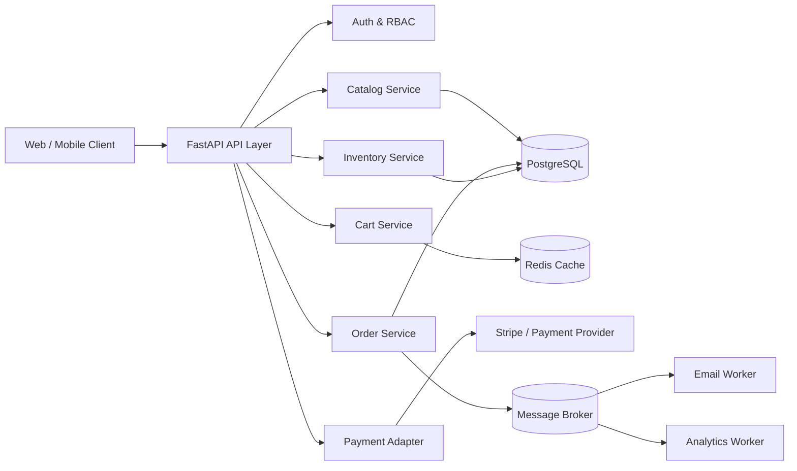
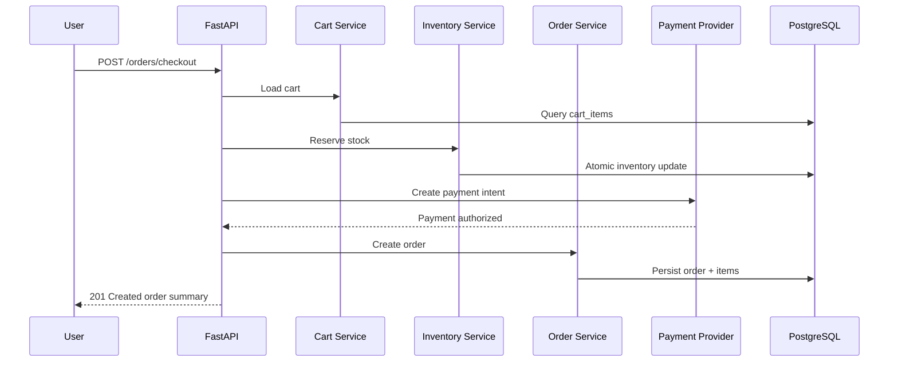

# FastAPI E-commerce Backend

A production-grade, interview-focused FastAPI backend blueprint for an e-commerce platform. The project demonstrates clean architecture, async APIs, domain-driven modules, relational database design, security practices, observability, deployment guidance, and interview preparation notes.

## What You Will Learn

- How to design an e-commerce backend from first principles.
- How to structure a FastAPI service for production maintainability.
- How to model users, catalogs, carts, orders, payments, and inventory.
- How to explain backend tradeoffs in senior engineering interviews.
- How to deploy and operate the service safely.

## Architecture Overview



## Request Flow



## Generated Guides

- [System Design](SYSTEM_DESIGN.md)
- [Backend Guide](BACKEND_GUIDE.md)
- [Interview Prep](INTERVIEW_PREP.md)
- [Database Design](DATABASE_DESIGN.md)
- [API Design](API_DESIGN.md)
- [Deployment Guide](DEPLOYMENT_GUIDE.md)

## Repository Layout

```text
app/
  api/            # HTTP routers and request/response schemas
  core/           # settings, security, logging
  domain/         # business entities and domain services
  infrastructure/ # database, cache, payment, email adapters
  main.py         # FastAPI application factory
```

## Local Development

```bash
python -m venv .venv
source .venv/bin/activate
pip install -r requirements.txt
uvicorn app.main:app --reload
```

## Production Principles

1. Keep business logic out of route handlers.
2. Use database transactions for checkout consistency.
3. Make payment and order workflows idempotent.
4. Treat inventory reservation as a concurrency problem.
5. Add observability before incidents happen.
6. Prefer explicit API contracts and versioning.

## Interview Framing

When explaining this backend, lead with the business problem, identify critical invariants, describe consistency boundaries, and justify tradeoffs around latency, availability, and correctness.
