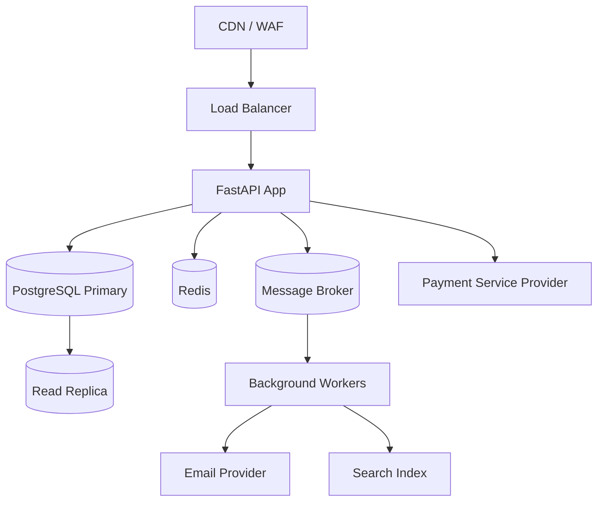
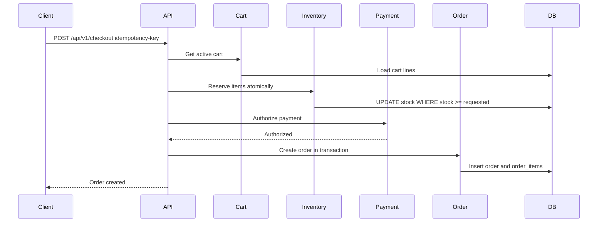

# System Design: Production E-commerce Backend

## 1. Problem

An e-commerce backend must support product discovery, authenticated customers, shopping carts, checkout, payments, inventory correctness, order history, admin operations, and operational visibility. The hardest parts are not CRUD endpoints; they are correctness under concurrency, safe payment retries, inventory consistency, and graceful degradation when external providers fail.

## 2. Design

### Core Capabilities

- User registration, login, JWT authentication, and role-based authorization.
- Product catalog with categories, variants, prices, and search-ready metadata.
- Cart management with item quantity updates and price validation at checkout.
- Checkout workflow with inventory reservation and payment authorization.
- Order lifecycle: pending, paid, fulfilled, cancelled, refunded.
- Admin APIs for catalog, inventory, and order management.
- Event-driven side effects for email, analytics, and fulfillment.

### High-Level Components

### Bounded Contexts

| Context | Responsibility | Key Invariants |
| --- | --- | --- |
| Identity | Users, auth, roles | Passwords are hashed; admin APIs require roles |
| Catalog | Products, categories, prices | Product SKUs are unique; money uses integer cents |
| Cart | Customer purchase intent | Cart prices are revalidated at checkout |
| Inventory | Stock availability | Stock cannot become negative |
| Orders | Purchase records | Orders are immutable after payment except status transitions |
| Payments | Provider integration | Payment operations are idempotent |

### Checkout Sequence

## 3. Alternatives

### Modular Monolith vs Microservices

- Modular monolith is preferred initially because transactions are simpler, deployment is easier, and team velocity is higher.
- Microservices become useful when catalog, checkout, fulfillment, and payments have independent scaling and team ownership needs.

### Synchronous Checkout vs Eventual Checkout

- Synchronous checkout gives immediate customer feedback but couples the request to payment latency.
- Eventual checkout improves resilience but requires more state management and customer-facing pending states.

### PostgreSQL vs NoSQL

- PostgreSQL is preferred because orders, payments, and inventory require strong relational integrity.
- NoSQL can support high-scale product browsing, but transactional data remains relational.

## 4. Interview Questions

1. How do you prevent overselling inventory during flash sales?
2. How would you make checkout idempotent?
3. Where would you draw service boundaries if the monolith becomes too large?
4. How do you handle payment provider timeouts?
5. What metrics indicate checkout health?

## 5. Tradeoffs

- Strong consistency for inventory can reduce throughput but protects revenue and trust.
- Caching catalog data improves latency but introduces invalidation complexity.
- Event-driven side effects improve reliability but require idempotent consumers.
- A modular monolith limits independent scaling but simplifies early development.
